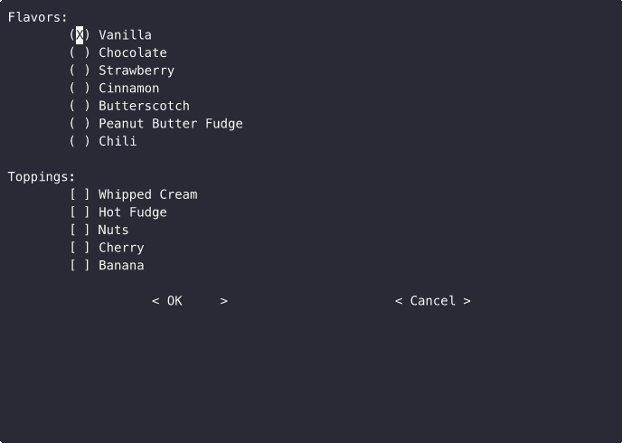

|repostatus| |ci-status| |license|

.. |repostatus| image:: https://www.repostatus.org/badges/latest/concept.svg
    :target: https://www.repostatus.org/#concept
    :alt: Project Status: Concept – Minimal or no implementation has been done
          yet, or the repository is only intended to be a limited example,
          demo, or proof-of-concept.

.. |ci-status| image:: https://github.com/jwodder/curselect/actions/workflows/test.yml/badge.svg
    :target: https://github.com/jwodder/curselect/actions/workflows/test.yml
    :alt: CI Status

.. |license| image:: https://img.shields.io/github/license/jwodder/curselect.svg
    :target: https://opensource.org/licenses/MIT
    :alt: MIT License

`GitHub <https://github.com/jwodder/curselect>`_
| `Issues <https://github.com/jwodder/curselect/issues>`_

This is a crude Python library for presenting a user with a full-screen
terminal interface consisting of a series of *selection lists* (radio buttons
and sets of checkboxes) and capturing their choices.

Usage, in brief:

- Instantiate a ``Form``

- Call ``form.add(field_name, selector)`` with each ``Selector`` or
  ``MultiSelector`` you wish to present to the user

  - For those fields that can be set on both ``Form`` and the selector classes,
    leaving them unset/``None`` on a selector causes the selector to inherit
    the value from the ``Form``.

- Call ``form.run()`` to run the interface and get the user's selections

  - This method returns a ``dict`` mapping field names to selections, or
    ``None`` if the user cancelled
  - The selection for a ``Selector`` is either the selected value or ``None``
  - The selection for a ``MultiSelector`` is either a list of selected values
    or (if none were selected *and* the ``defaults`` parameter was ``None``)
    ``None``

The terminal interface supports the following keybindings:

.. role:: kbd(literal)

- :kbd:`j`, :kbd:`Down` — move down
- :kbd:`k`, :kbd:`Up` — move up
- :kbd:`h`, :kbd:`Left` — move left
- :kbd:`l`, :kbd:`Right` — move right
- :kbd:`w`, :kbd:`Page Up` — go up a page
- :kbd:`z`, :kbd:`Page Down` — go down a page
- :kbd:`g` — go to first item [#broken]_
- :kbd:`G` — go to last item [#broken]_
- :kbd:`Tab` — go to next selection list [#broken]_
- :kbd:`Shift` + :kbd:`Tab` — go to previous selection list [#broken]_
- :kbd:`Enter`, :kbd:`Space` — select/activate current selection
- :kbd:`q`, :kbd:`Q` — cancel

.. [#broken] Does not work correctly due to
   https://github.com/urwid/urwid/issues/466

Installation
============
``curselect`` requires Python 3.10 or higher.  Just use `pip
<https://pip.pypa.io>`_ for Python 3 (You have pip, right?) to install it::

    python3 -m pip install git+https://github.com/jwodder/curselect.git

Example
=======

.. code:: python

    import json
    from curselect import Form, MultiSelector, Selector

    form = Form()
    form.add(
        "flavor",
        Selector(
            "Flavors:",
            [
                "Vanilla",
                "Chocolate",
                "Strawberry",
                "Cinnamon",
                "Butterscotch",
                "Peanut Butter Fudge",
                "Chili",
            ],
            default=0,
        ),
    )
    form.add(
        "toppings",
        MultiSelector(
            "Toppings:",
            [
                "Whipped Cream",
                "Hot Fudge",
                "Nuts",
                "Cherry",
                "Banana",
            ],
        ),
    )
    selections = form.run()
    print(json.dumps(selections, indent=4))

